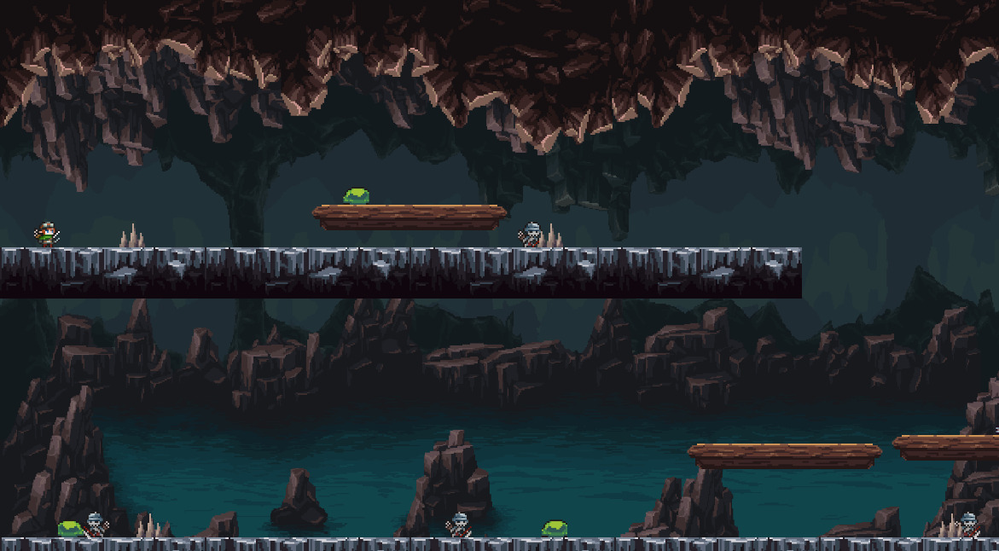
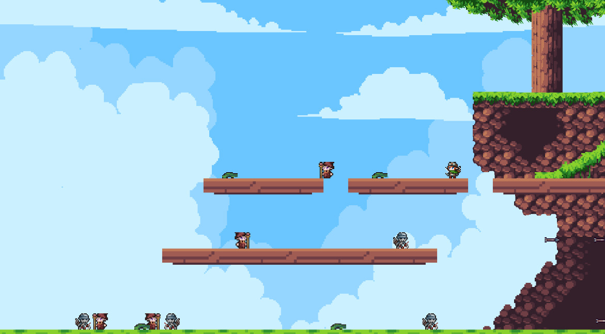

# Ymir & Helga

Ymir & Helga is a two-player 2D platform game where two heroes fight their
way through enemy-filled levels together — on the same keyboard.

Grab a friend, pick your hero, and jump into the adventure!


*Caverna level*


*Planície level*

## About the game

- **Local co-op** — two players share one keyboard and play side by side.
- **Combat** — each hero has their own attack; time it right to defeat enemies.
- **Multiple levels** — battle through different environments, each with its
  own look and challenges.
- **Enemy AI** — enemies react to the players as you progress.

The game was designed and built from scratch with object-oriented
architecture, covering everything from gameplay and physics to menus and
level progression.

## Controls

- Menus: `W`/`S` to move and `Enter` to select.
- Player 1: `A`/`D` to move, `W` to jump, and `Space` to attack.
- Player 2: arrow keys to move and jump, right `Shift` to attack.
- `Escape` pauses the game during a level.

## Play it

The game ships as a self-contained Linux AppImage — no installation or
dependencies needed. Download the latest
`Ymir-Helga-Linux-x86_64` artifact from the
[releases on GitHub Actions](https://github.com/ediasv/ymir-helga/actions/workflows/appimage.yml),
make it executable, and run it:

```sh
chmod +x Ymir_Helga-x86_64.AppImage
./Ymir_Helga-x86_64.AppImage
```

## Built with

- **C++17** — core game logic and architecture
- **SFML 2** — graphics, audio, and input
- **CMake** — build system
- **GoogleTest** — automated testing

## License

Ymir & Helga is licensed under the [GNU General Public License v3.0](LICENSE).
